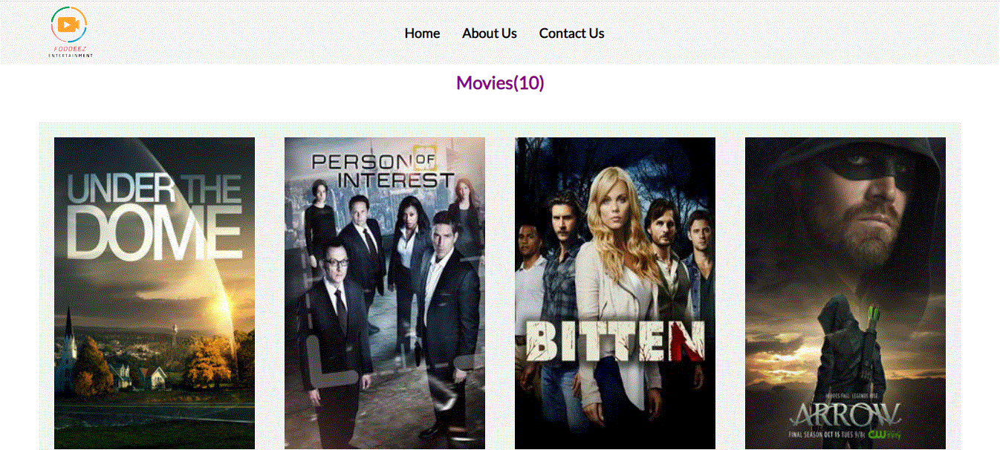

# INFLIX
> This web application is a type of a showcase of movies with details of the movies and an option to get comments on each movie. which is using API's to get and set data.

## Video Presentation

[Click on the link to see the presentation](https://www.loom.com/share/b423886962bd42afb9f12c3e6f2986ea)

## Live Demo

[Live Demo]()

## Built With

- HTML
- CSS
- JavaScript
- Webpacks

## Get Live Demo

<!-- [Live Demo Link](https://hammas-saleem.github.io/ToDoList/) -->

## Clone and review it

Run the following commands to clone and run it.

### To clone the repository

  `git clone git@github.com:HAMMAS-SALEEM/ToDoList.git`

### To enter Directory

`cd ToDoList`

### To Install Packages

`npm install`

### To run project on local server

`npm start`

### To run project tests

`npm test`

### To open project with vs code 

`code .`

## Authors

👤 **Hammas Bin Saleem**

- GitHub: [@HAMMAS-SALEEM](https://github.com/HAMMAS-SALEEM)
- Twitter: [@HammasSaleem4](https://twitter.com/HammasSaleem4)
- LinkedIn: [HAMMAS SALEEM](https://www.linkedin.com/in/hammas-saleem-407)

👤 **Tarikwa Tesfa**

- GitHub: [Tarikwa Tesfa](https://github.com/tariktesfa)
- Twitter: [Tarikwa Tesfa](https://twitter.com/tarik_tesfa)
- LinkedIn: [Tarikwa Tesfa](https://www.linkedin.com/in/tarikwa-tesfa-232a64167/)

## 🤝 Contributing
Contributions, issues, and feature requests are welcome!
Feel free to check the [issues page](../../issues/).

## Show your support
Give a ⭐️ if you like this project!

## Acknowledgments
- Hat tip to anyone whose code was used
- Inspiration
- etc

## 📝 License
This project is [MIT](./MIT.md) licensed.
